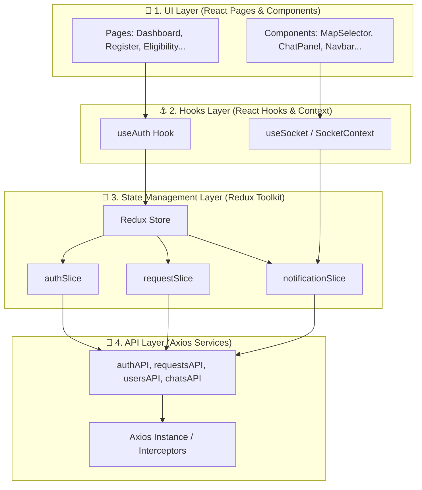

# 🩸 Emergency Blood Connector — Frontend Client App

This is the web client application for the **Emergency Blood Connector** platform. It provides a highly responsive, modern dashboard interface designed to connect users needing emergency blood with compatible, nearby donors.

The application is built using **React, Vite, and TailwindCSS**, utilizing **Redux Toolkit** for state management, **Axios** for API requests (featuring automatic token rotation), **Socket.io-client** for real-time chat and push alerts, and interactive components like **Leaflet Maps** for coordinate tracking.

---

## 🏗️ 4-Layer Frontend Architecture

To ensure strict separation of concerns, scalability, and clean testing boundaries, the frontend codebase is organized into four distinct architectural layers:



---

### Layer 1: The UI (Pages & Components)
Responsible purely for data presentation and dispatching user actions.

#### Pages (`src/pages`)
*   **Landing Page (`LandingPage.jsx`)**: The entrance page featuring platform overviews, live metrics (active donors, lives saved, matches) fetched from the backend `/stats` endpoint, a description of how it works, and a quick-lookup compatibility card.
*   **Login Page (`auth/LoginPage.jsx`)**: Secure entry interface checking credential forms before calling authentication actions.
*   **Register Page (`auth/RegisterPage.jsx`)**: Multi-step registration form gathering user metadata, role choices (donor vs. receiver), blood groups, and featuring an interactive map location picker.
*   **Donor Dashboard (`dashboard/DonorDashboard.jsx`)**: Central hub for blood donors. Features:
    *   An availability status switch (Available/Unavailable) which updates state in the backend.
    *   A feed of nearby matching pending blood requests with geolocated distance tags.
    *   Acceptance tools to commit to a request.
    *   A logs page displaying donation history, count statistics, and cooldown timelines.
*   **Receiver Dashboard (`dashboard/ReceiverDashboard.jsx`)**: Central hub for blood receivers. Features:
    *   A panel showing active, pending, accepted, completed, or cancelled requests.
    *   A blood request creation wizard containing patient info, required dates, contact numbers, and a location coordinate picker map.
    *   Acceptance details displaying the accepted donor's name, blood type, and contact phone number.
    *   An embedded chat console for direct communication.
*   **Eligibility Page (`donor/EligibilityPage.jsx`)**: Interactive checklist evaluating whether a donor meets age, health, and 90-day cooldown criteria.
*   **Compatibility Page (`receiver/CompatibilityPage.jsx`)**: Reference matrix mapping blood group recipient compatibilities.
*   **Not Found Page (`NotFoundPage.jsx`)**: 404 handler for invalid routes.

#### Components (`src/components`)
*   **Chat Panel (`dashboard/ChatPanel.jsx`)**: A messaging interface that connects to Socket.io. It registers users into the request chat room, sends and receives real-time messages, and displays messages with user details.
*   **Map Selector (`dashboard/MapSelector.jsx`)**: Built on Leaflet and OpenStreetMap. Allows users to click on the map to pin coords (updating longitude and latitude state values during registration or request creation) and displays the hospital coordinate.
*   **Profile Edit Modal (`dashboard/ProfileEditModal.jsx`)**: An overlay allowing logged-in users to update non-sensitive metadata (phone, age, avatar, city).
*   **UI Elements (`ui/Navbar.jsx`)**: Main navigation containing application logo, page links, user profile dropdowns, and a real-time notification bell dropdown displaying active unread count badges.

---

### Layer 2: The Hooks & Contexts
Connects React components with the state managers and context providers.

*   **Authentication Hook (`src/hooks/useAuth.js`)**:
    *   Synthesizes user details directly from the Redux store.
    *   Exposes reactive boolean flags (`isAuthenticated`, `isLoading`, `isAdmin`, `isDonor`, `isReceiver`).
    *   Wraps Redux dispatchers for `login(credentials)`, `register(userData)`, `logout()`, and `clearAuthError()`.
*   **Socket Context (`src/context/SocketContext.jsx`)**:
    *   Initializes the WebSocket `socket.io-client` connection on login.
    *   Registers the socket connection to the user's private notification channel.
    *   Listens for incoming `"notification"` events and pushes them to Redux and triggers a floating browser notification toast using `react-hot-toast`.
    *   Terminates connections on logout.

---

### Layer 3: State Management (Redux Toolkit)
Centralized client store maintaining user sessions, active requests, and notifications.

*   **Redux Store (`src/app/store.js`)**: Mounts slices and configures standard middlewares:
    ```javascript
    import { configureStore } from '@reduxjs/toolkit'
    import authReducer from '@/features/auth/authSlice'
    import requestReducer from '@/features/requests/requestSlice'
    import notificationReducer from '@/features/notifications/notificationSlice'

    export const store = configureStore({
      reducer: {
        auth: authReducer,
        requests: requestReducer,
        notifications: notificationReducer,
      }
    })
    ```
*   **Auth Slice (`features/auth/authSlice.js`)**:
    *   *Async Thunks*: `registerUser`, `loginUser`, `logoutUser`, `fetchCurrentUser` (restores session using cookies on page load).
    *   *State*: User profile info, authentication token, initialization flags, errors.
*   **Request Slice (`features/requests/requestSlice.js`)**:
    *   *Async Thunks*: `fetchAvailableRequests`, `fetchMyRequests`, `createBloodRequest`, `acceptBloodRequest`.
    *   *State*: Feeds of available requests, user's own requests, paginations, and loading/creation states.
*   **Notification Slice (`features/notifications/notificationSlice.js`)**:
    *   *Async Thunks*: `fetchNotifications` (fetches past notifications), `markAllRead` (marks notifications read on backend).
    *   *State*: List of notifications, unread count. Exposes `addNotification` to push real-time WebSocket alerts directly into the navbar list.

---

### Layer 4: The API Layer (Axios Services)
Defines direct backend communication and implements automated token security.

*   **Axios Configuration (`src/services/api.js`)**:
    *   `baseURL` set to `/api/v1` (Proxied to backend via Vite).
    *   `withCredentials: true` enables cookie exchanges.
*   **Token Interceptors**:
    1.  **Request Interceptor**: Extracts the `accessToken` from `localStorage` and appends it as a `Bearer` token in the `Authorization` header.
    2.  **Response Interceptor (JWT Auto-Rotation & Refresh Queue)**:
        *   If an endpoint returns `401 Unauthorized` (indicating the token expired) and has not been retried:
        *   It blocks concurrent request retries by setting `isRefreshing = true` and queues all incoming requests.
        *   It dispatches a token refresh call to `POST /auth/refresh-token`.
        *   *On Success*: Saves the new access token, flushes the queued requests with the updated token, and retries the original request.
        *   *On Failure*: Clears the access token from `localStorage` and redirects the user to `/login`.
*   **API Service Modules**:
    *   `authAPI`: Handles registration, login, logout, profile checks, and token refreshes.
    *   `requestsAPI`: Handles CRUD operations for blood requests, along with status updates (accept, cancel, complete).
    *   `usersAPI`: Handles donor listings, profile edits, availability status updates, notifications, and donation history logs.
    *   `chatsAPI`: Fetches chat room histories between matching users.
    *   `homeAPI`: Retrieves statistics for the landing page.

---

## 🔀 Routing & Navigation Flows

The client-side routing uses `react-router-dom` to enforce user access rules (RBAC).

```text
/ (Public Landing Page)
├── /login (Public Auth Form)
└── /register (Public Registration wizard)
└── Protected Route wrapper (verifyJWT)
    ├── /dashboard (Role Redirect -> donor vs. receiver vs. admin)
    │
    ├── Role Route: [donor, admin]
    │   ├── /dashboard/donor (Donor workspace)
    │   └── /donor/eligibility (Eligibility checklist)
    │
    └── Role Route: [receiver, admin]
        ├── /dashboard/receiver (Receiver workspace)
        └── /receiver/compatibility (Compatibility grid)
```

1.  **Session Restore**: On app mount, `App.jsx` dispatches `fetchCurrentUser` which reads HTTP-only session cookies.
2.  **Protected Route (`routes/ProtectedRoute.jsx`)**: Checks if the user is authenticated. If not, it redirects the user to `/login`.
3.  **Role Route (`routes/RoleRoute.jsx`)**: Compares the user's role against required roles (e.g. only `donor` can visit the donor dashboard). If there is a mismatch, the user is redirected to the home page.
4.  **Smart Dashboard Redirect (`/dashboard`)**: Redirects users to their specific dashboard based on their role (`/dashboard/donor` or `/dashboard/receiver`).

---

## 🛠️ Setup & Local Execution

### Vite Configuration (`vite.config.js`)
Configured to resolve paths using `@/` and proxy API calls to port `5000` to avoid CORS issues:

```javascript
server: {
  port: 5173,
  proxy: {
    '/api': {
      target: 'http://localhost:5000',
      changeOrigin: true,
      secure: false,
    },
  },
}
```

### Run Commands
Make sure the backend is running on `http://localhost:5000`.

```bash
# Navigate to the frontend directory
cd frontend

# Install client packages
npm install

# Start Vite developer server (runs at http://localhost:5173)
npm run dev

# Compile production bundle
npm run build
```
